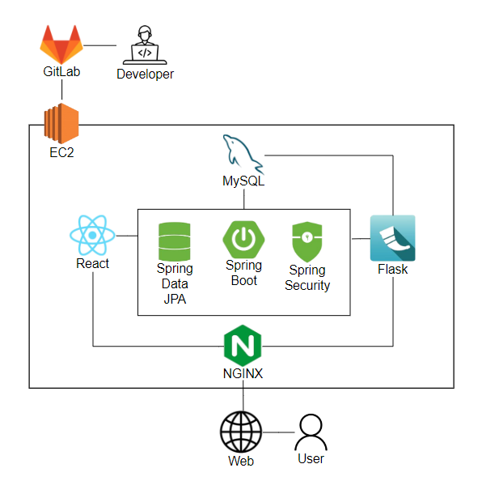
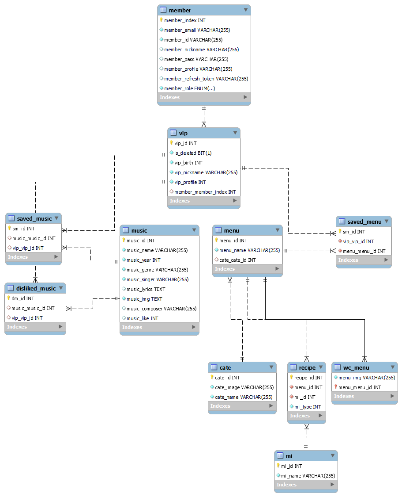
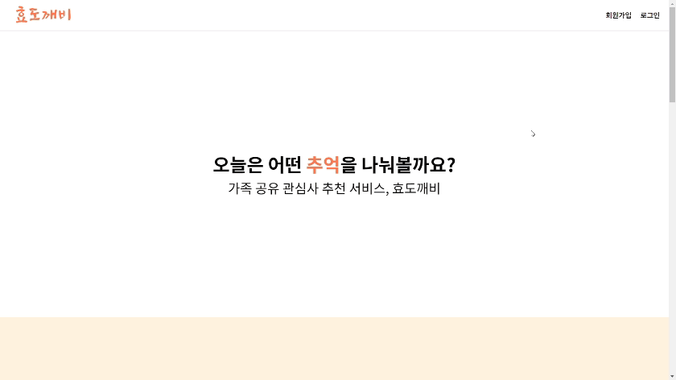
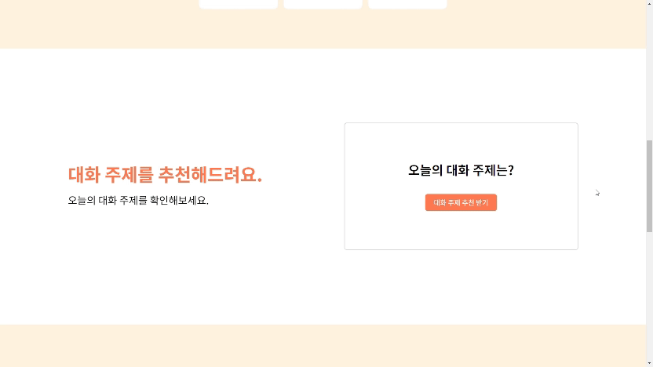
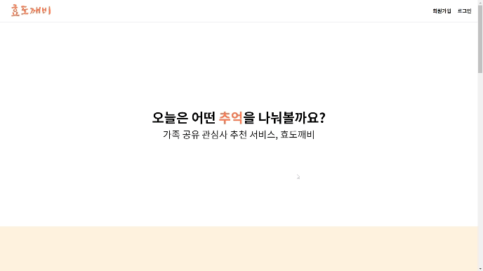
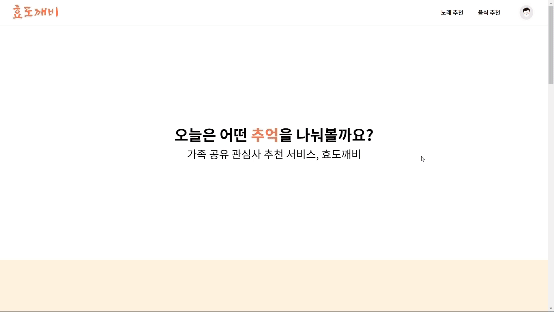
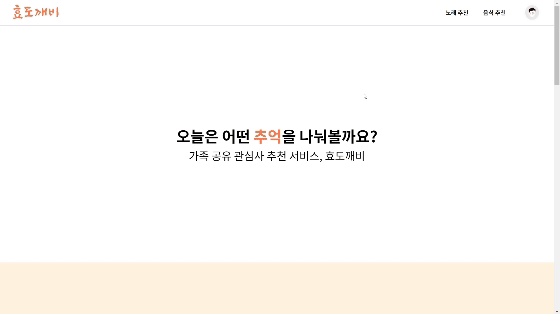
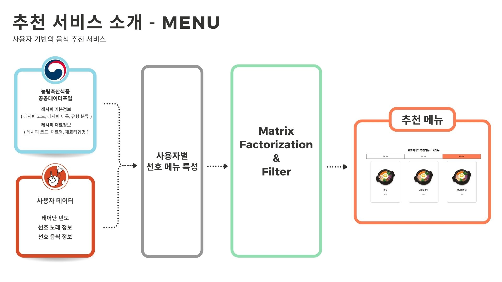
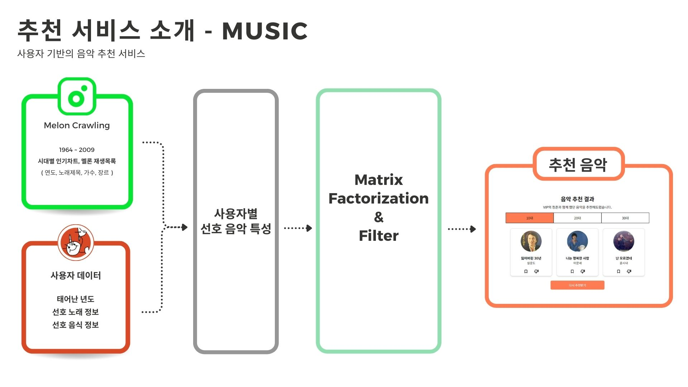
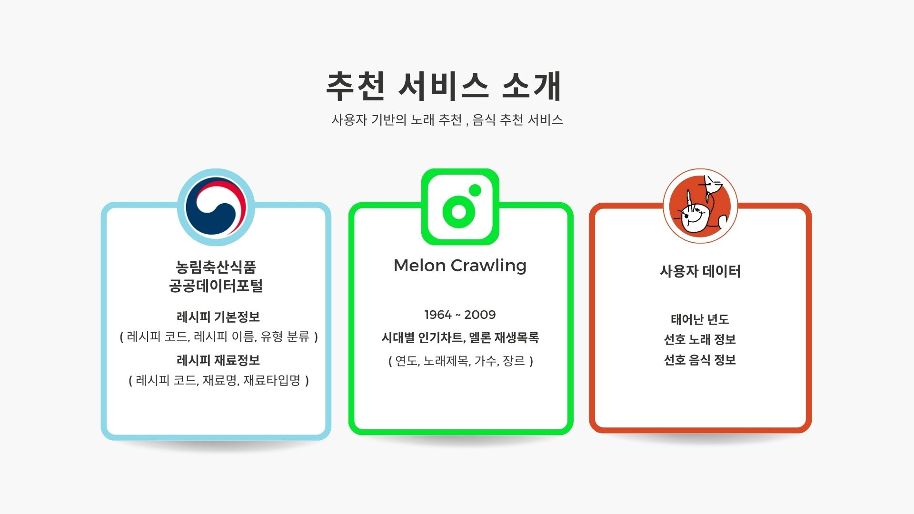

# </img> 효도깨비 | 가족 공유 관심사 추천 서비스

</img>

(조)부모님 세대와의 소통 증진을 위한 나와 가족과의 대화주제 및 관심사 추천 서비스입니다.

**2024.02.26 ~ 2024.04.05 (6주)**

**Team. 효도르**  
총 6명 (프론트3, 백3)

# 프로젝트 개요

### 주요 기능

1. 부모님/조부모님 세대와 나눌 수 있는 대화 주제 추천
2. 부모님/조부모님 세대가 좋아할 음악 추천
3. 부모님/조부모님 세대가 좋아할 음식점 추천

# 프로젝트 소개

### 기획 배경 및 의도

평소 소통이 많지 않았던 부모-자식, 조부-손주 관계에서 효도란 어떤 것인가 떠올리면서 시작됩니다.

- **조부-손주 관계에서의 효도**  
  서로 멀리 떨어져 살아서 소통이 부족하고, 자주 만나지 못하는 경우가 많습니다. 이로 인해 대화가 제한되고, 얼굴을 마주하는 일이 줄어들게 됩니다. 특히 손주의 경우, 른과의 대화 방식에 익숙하지 않을 수 있어 대화에 어려움을 겪을 수 있습니다.

- **부모-자식 관계에서의 효도**  
  인터넷과 통신의 발달로 인해 부모와 자식이 멀리 떨어져 사는 경우가 늘어나고 있습니다. 이로 인해 서로의 삶과 관심사를 파악하지 못하게 되는 문제가 발생할 수 있습니다. 함께 보내는 시간이 줄어들면서 부모와 자식 간의 유대감이 약화될 수 있습니다.

**목적**

- 효도에 보탬이 되는 서비스 제공
- 가족 간의 소통 강화
- 세대 간의 유대감 유지
- 세대 갈등 해결
- 세대 간 문화 교류 증진

**기대효과**

- 소통량 증가
- 가족 간의 긍정적 상호 작용 증대
- 추억 공유 및 저장률 증가

##### [프로젝트 소개 영상]

[B305 UCC 보러가기](README_assets/3_UCC.mp4)

### 팀원 소개 & 역할 및 담당 기능

| 팀원   | 역할      | 담당 기능                                           |
| ------ | --------- | --------------------------------------------------- |
| 임지은 | 팀장, FE  | 로그인, 회원가입, 노래 추천, UI/UX 디자인           |
| 우재하 | FE        | VIP CRUD, 대화주제 추천, 라우터 구현, CSS 규격 통일 |
| 전성수 | BE        | 로그인, 회원가입 기능 구현                          |
| 김다윤 | BE, ML    | 노래 추천 모델, VIP별 선호 노래 CRUD, VIP 정보 CRUD |
| 이현정 | BE, ML    | 음식 추천 모델, VIP별 선호 메뉴 저장 및 추가        |
| 우지민 | FE, INFRA | 음식 추천, VIP가 저장한 리스트, 배포                |

## Stack

**Environment**  

  
**BackEnd**  

  
**Data**  

 

**FrontEnd**  

   
**DataBase**  
  
**Version Control**  
  
**Deployment**  

  
**API**  
  
**Communication**  

#### 와이어 프레임

</img>

#### ERD

</img>

## 주요 화면

#### 메인 페이지

{: width="688" }

#### 대화 주제 추천

#### 로그인 페이지

#### VIP 페이지

#### 노래 추천

#### 음식 추천

## 사용 기술

### 빅데이터 추천

### 사용 데이터

## 협업 방법

#### [효도르 협업방법 보러가기](https://creative-freon-af5.notion.site/GitLab-Jira-1bfd29a8d31c4be1863f26491f47380d?pvs=4)

#### [포팅 메뉴얼](https://github.com/SSAFY-B305J/Hyodokebi/blob/master/exec/%ED%8F%AC%ED%8C%85%EB%A9%94%EB%89%B4%EC%96%BC.pdf)
